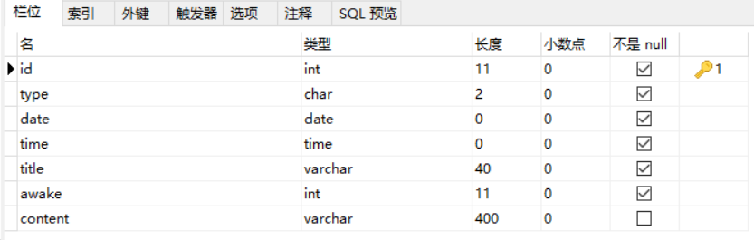
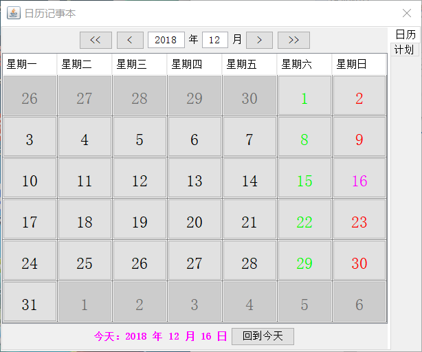
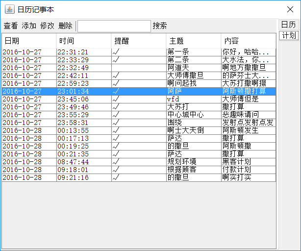

# CalendarPad —— 日历记事本
课程实训做了一个日历记事本，显示日历，可以设置计划备忘录，包含增删改查和提醒功能。

## 相关环境
- javaSE-1.6
- eclipseEE Version: Mars.2 Release (4.5.2)
- mysql 11.0.10

## 概述
### 实现功能
1. 日历展示  
2. 备忘录，存入数据库，增删改查
3. 提醒功能，线程实现，实现的一般

### 数据表设计

## 代码结构
- `com.qwk.DesktopFairyDialog.java` 程序入口
- `com.qwk.calendar/` 日历设计相关类
- `com.qwk.dao/` 数据库访问
- `com.qwk.frame/` 记事备忘录的相关类包
- `com.qwk.mwing/` 其中定义了时间输入框
- `com.qwk.tabbedPane/` 包含一个初始化日历界面的Panel和关于记事记录界面的Panel
- `com.qwk.tool/` 提醒的线程实现在这里

## 效果图
- 日历

- 计划

## Authors
qiwenkaikai@qq.com